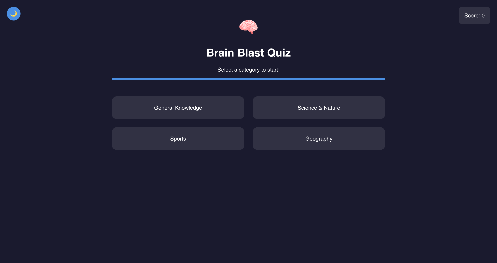
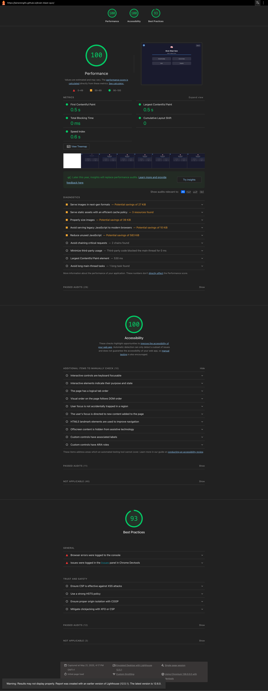

# Brain Blast Quiz

## Screenshot

## Project Introduction
**Brain Blast Quiz** is a modern, interactive web application designed to test and expand your knowledge across various topics. Whether you want to challenge yourself or compete with friends, this quiz game offers a fun and engaging way to learn. The project is ideal for anyone interested in trivia, education, or simply looking for an entertaining way to pass the time.

## What is this project for?
This project demonstrates how to build a responsive, user-friendly quiz application using web technologies. It can be used as:
- A learning tool for students and trivia enthusiasts
- A template for developers learning front-end web development
- A foundation for more advanced quiz or educational apps

## Programming Languages & Technologies Used
- **HTML5**: Structure of the web pages
- **CSS3**: Styling, layout, and responsive design (including dark/light themes)
- **JavaScript (ES6+)**: Game logic, interactivity, and API integration
- **Open Trivia Database API**: Source of quiz questions

## Colors & Fonts
- **Primary Color:** `#4A90E2`
- **Secondary Color:** `#50E3C2`
- **Dark Background:** `#1A1A2E`
- **Light Background:** `#f5f6fa` to `#e9ecef` (gradient)
- **Text (Dark):** `#FFFFFF`
- **Text (Light):** `#22223B`
- **Font:** `'Poppins', sans-serif`

## Key Features
- Multiple categories to choose from (General Knowledge, Science & Nature, Sports, Geography)
- 10 random questions per quiz session
- Instant feedback on answers
- Score tracking throughout the game
- Dark and light theme toggle for comfortable viewing
- Responsive design for mobile, tablet, and desktop
- Option to return to category selection at any time

## Usage Instructions
1. **Clone or download the repository.**
2. **Open the project folder in VS Code.**
3. **Start Live Server** (or open `index.html` directly in your browser).
4. **Select a category** to begin the quiz.
5. **Answer the questions** by clicking on the options.
6. **Switch between dark and light themes** using the 🌙/🌞 button in the top left.
7. **Return to category selection** at any time using the ⬅ Back button.

Enjoy testing your knowledge and have fun with Brain Blast Quiz!
