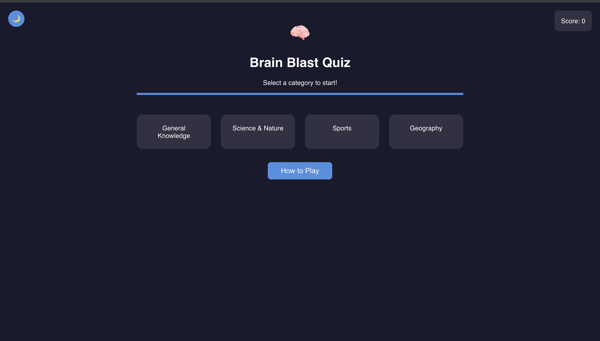

# 🧠 Brain Blast Quiz

Brain Blast Quiz is a vibrant, interactive web quiz app that challenges users with fun questions across multiple categories. Designed for learning and entertainment, it features a modern UI, dark/light theme toggle, smooth animations, a timer, and dynamic category swapping. Built as a JavaScript project to demonstrate dynamic DOM manipulation, API integration, and responsive design.

---

---

## 🔗 Live Demo

[Try Brain Blast Quiz](https://lainerengifo.github.io/brain-blast-quiz/)

---

## 📖 Table of Contents

- [Project Overview](#project-overview)
- [UX/UI Design](#uxui-design)
- [User Stories](#user-stories)
- [Colors & Fonts](#colors--fonts)
- [Features](#features)
- [Built With](#built-with)
- [Testing](#testing)
- [Deployment](#deployment)
- [Future Features](#future-features)
- [Known Bugs](#known-bugs)
- [Citation](#citation)

---

## 📌 Project Overview

**Brain Blast Quiz** is a single-page web app that lets users test their knowledge in categories like General Knowledge, Science & Nature, Sports, and Geography. Questions are fetched live from [the-trivia-api.com](https://the-trivia-api.com/), ensuring a fresh experience every time. After each quiz, the played category is swapped out for a new one from a pool of extra categories, keeping the game fresh and surprising.

---

## 🎨 UX/UI Design

- Clean, modern interface with responsive layout
- Dark and light theme toggle for comfortable viewing
- Animated transitions for feedback and engagement
- Custom modal dialogs for end-of-game and "How to Play" instructions
- Colorful feedback for correct (green) and wrong (red) answers

---

## 🛠️ User Stories

As a user, I want to:
- ✅ Select a quiz category
- ✅ Answer multiple-choice questions
- ✅ See instant feedback and my score
- ✅ Switch between dark and light themes
- ✅ Return to category selection at any time
- ✅ Play on mobile, tablet, or desktop
- ✅ See a timer and my progress (e.g., "Question 3 of 10")
- ✅ See a celebratory modal when I finish the quiz
- ✅ Learn how to play via a "How to Play" button
- ✅ See new categories appear after finishing a quiz

---

## 🎨 Colors & Fonts

| Purpose         | Color/Font                      |
|-----------------|--------------------------------|
| Primary         | `#4A90E2`                      |
| Secondary       | `#50E3C2`                      |
| Dark Background | `#1A1A2E`                      |
| Light Background| `#f5f6fa` → `#e9ecef` (gradient)|
| Text (Dark)     | `#FFFFFF`                      |
| Text (Light)    | `#22223B`                      |
| Correct Answer  | `#2ECC71` (Green)              |
| Wrong Answer    | `#E74C3C` (Red)                |
| Font            | `'Poppins', sans-serif`        |

---

## 🚀 Features

- Dynamic category and question generation via JavaScript
- Fetches questions from [the-trivia-api.com](https://the-trivia-api.com/)
- Score tracking and animated progress bar
- Timer showing elapsed time for each quiz
- "Question X of Y" progress indicator
- Dark/light theme toggle
- Responsive design for all devices
- Back button to return to category selection
- Animated feedback for correct/wrong answers (green/red)
- Custom modal for end-of-game celebration
- "How to Play" button with colorful, clear instructions
- After each quiz, the played category is replaced with a new random category from a large pool

---

## 🛠️ Built With

- **HTML5**: Semantic structure
- **CSS3**: Styling, layout, responsive design, and themes
- **JavaScript (ES8+)**: Game logic, DOM manipulation, API integration
- **[the-trivia-api.com](https://the-trivia-api.com/)**: Live quiz questions

---

## ✅ Testing

- Tested on Chrome, Firefox, and mobile browsers
- Responsive layout verified on various screen sizes
- [HTML validated with W3C Validator](https://validator.w3.org/)
- [CSS validated with W3C CSS Validator](https://jigsaw.w3.org/css-validator/) 
- Manual testing for all user stories and features

### 📸 Screenshots

- [Responsive Screenshot](assets/screenshot-responsive.png)
- [Dark Theme Screenshot](assets/screenshot-dark.png)
- [Light Theme Screenshot](assets/screenshot-light.png)
- [How to Play Modal](assets/screenshot-how-to-play.png)
- [HTML Validation Result](assets/html-validation.png)
- [CSS Validation Result](assets/css-validation.png)

---

## 🚀 Deployment

- Can be run locally by opening `index.html` in a browser
- Easily deployable via GitHub Pages or any static hosting

---

## 🔮 Future Features

- 🚀 Add more question types (true/false, fill-in-the-blank)
- 🚀 High score leaderboard
- 🚀 Sound effects and more animations
- 🚀 Persistent theme and score memory
- 🚀 User-selectable number of questions per quiz

---

## 🐞 Known Bugs

- ❌ Some special characters in questions may not render perfectly (API issue)
- ❌ If the API is unreachable, the quiz cannot start

---

## 📜 Citation

- [the-trivia-api.com](https://the-trivia-api.com/)
- [Poppins Font - Google Fonts](https://fonts.google.com/specimen/Poppins)
- Icons and favicon from [Icons8](https://icons8.com/)
